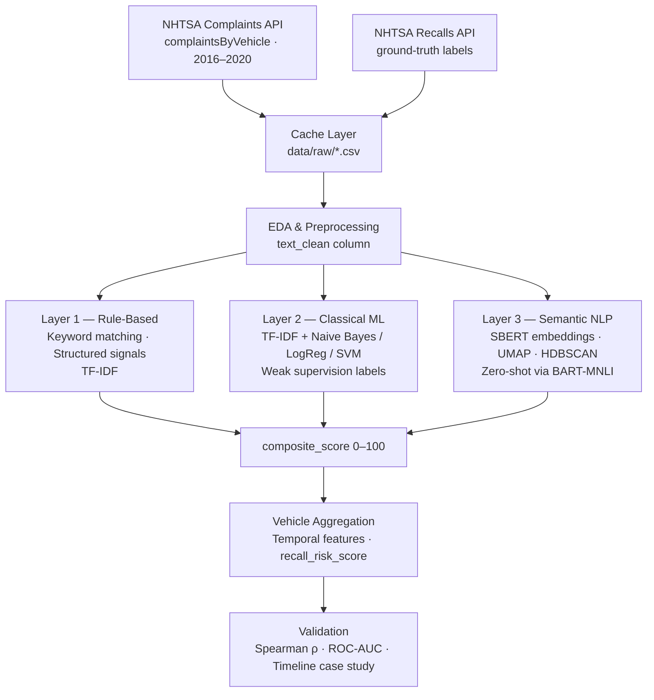

# NHTSA Early Warning System — Architecture

> **Complaints Precede Recalls**: An NLP pipeline that scores NHTSA consumer complaint narratives for criticality and predicts vehicle recalls before they are issued.

---

## Pipeline Overview



---

## Phases

### 1 · Data Ingestion

- **Complaints**: Dynamic vehicle catalogue built from API (makes × models × years). Pairs filtered for cross-year consistency and minimum complaint volume.
- **Recalls**: Pulled for the same catalogue; stored as ground-truth `actually_recalled` flag.
- **Cache**: `FORCE_REFETCH` flag; raw CSVs survive Colab session restarts.

### 2 · EDA & Preprocessing

- Vocabulary fragmentation audit (raw `brakes` / `BRAKES` / `braking` fragments treated as one concept post-cleaning).
- Domain-aware pipeline: lowercase → punctuation removal → stopword filter (negations *kept*: `not`, `no`, `never`) → WordNet lemmatisation.
- Automotive abbreviation expansion; compound term preservation (`steering_wheel`, `check_engine`).

### 3 · Criticality Scoring (3 NLP Layers)

| | Layer 1 — Rule-Based | Layer 2 — Classical ML | Layer 3 — Semantic NLP |
|---|---|---|---|
| **Input** | `text_clean` | `text_clean` | `text_clean` |
| **Method** | Tiered keyword matching; structured NHTSA flags (crash / fire / injury / fatality); component risk tiers; date-lag urgency; TF-IDF | Silver labels from structured flags; Naive Bayes → Logistic Regression → LinearSVC; 5-fold CV (F1) | SBERT `all-MiniLM-L6-v2` (384-dim); UMAP 384D→2D; HDBSCAN; `facebook/bart-large-mnli` zero-shot |
| **Output** | `keyword_score`, `component_risk`, `filed_quickly` | `ml_prob` | `sbert_cluster`, `zs_category`, `zs_confidence` |

**Composite score** (0–100): weighted combination of keyword score, ML probability, component risk, structured flags, and SBERT cluster depth.

### 4 · Vehicle Aggregation

Groups complaint-level scores by `vehicle_key` (make + model + year):

- **Temporal features**: monthly volume, 6-month complaint acceleration, date of first high-score complaint.
- **Aggregate signals**: mean composite score, crash/injury/fatality rates, dominant zero-shot defect category, cluster concentration.
- **Output**: `recall_risk_score` (0–100) per vehicle, bucketed into Critical / High / Medium / Low tiers.

### 5 · Validation

| Method | What it tests |
|---|---|
| Spearman ρ | Monotonic rank alignment between `recall_risk_score` and `actually_recalled` |
| ROC-AUC | Binary classification performance vs keyword-only baseline |
| Timeline case study | Monthly complaint chart confirming complaints spike *before* official recall date |

---

## Key NLP Concepts Demonstrated

- **Vocabulary normalisation** — why raw token counts mislead before cleaning
- **Weak supervision** — creating silver labels from structured fields to train a classifier
- **Baseline-first** — Naive Bayes → LogReg → SVM complexity ladder; only upgrade when justified
- **TF-IDF vs SBERT** — statistical frequency representation vs semantic sentence similarity
- **Unsupervised clustering** — HDBSCAN discovers defect mode groups without a preset k
- **Zero-shot classification** — NLI-based categorisation with no labelled training examples

---

## Dependencies

```
requests · pandas · numpy · nltk · spacy
scikit-learn · sentence-transformers · transformers
umap-learn · hdbscan · matplotlib · seaborn · scipy · tqdm
```
